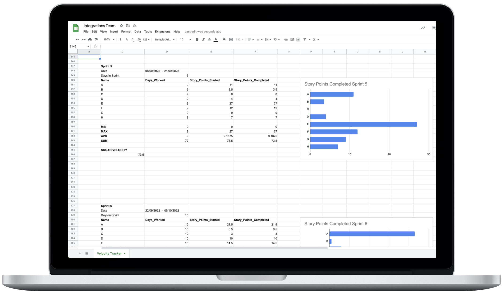

During my time at Yapily I implemented a Python script that allows agile teams to track, monitor and plan sprints. This script computes average and accumulated delivery speeds across sprints and developers. In order to do the above, the script connects to the Jira API to fetch sprint data, to the Google Calendar API in order to fetch team member’s OOO days and calculate team availability, and to the Google Sheets API to plot the resulting data.

Note: all credentials have been masked, so in order for this project code to run successfully, you will need to generate your own credentials and insert these accordingly.